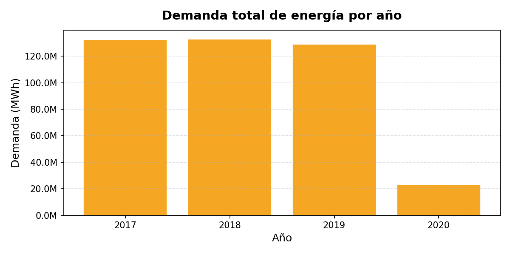
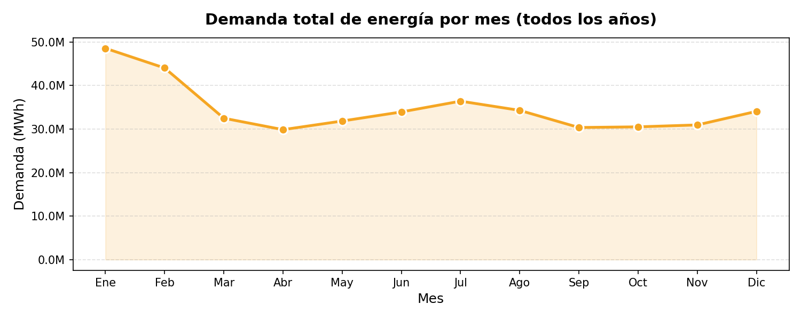
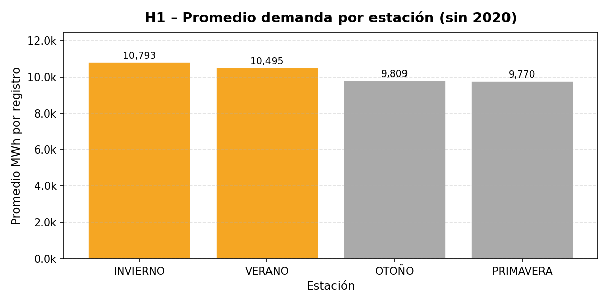
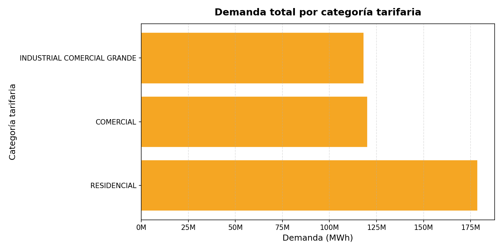
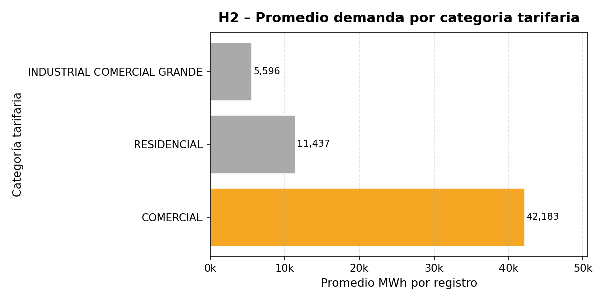

# Documentación del Proyecto — Eficiencia Energética

**Universidad del Gran Rosario (UGR)**  
**Materia:** Ingeniería del Software  
**Docentes:** Ing. Ignacio Sanseovich · Lic. Briant Gauna  
**Grupo:** 34

---

## Integrantes

| Nombre | Rol en el proyecto |
|--------|-------------------|
| Ivan Porcari | Desarrollo |
| Marcelo Saucedo | Desarrollo / EDA |
| Rodrigo Zamora | Backend / DB |
| Gaspar Giannitrapani | Modelado ML |
| Stefania Martos | EDA / Preparación de datos |
| Juan Ignacio Sasia | Backend / API |
| Juan José Muñoz Franchi | Frontend / DevOps |
| Jorge Nicolás Segovia | Frontend / Documentación |

---

## Resumen del Trabajo

Este trabajo aplica la metodología **CRISP-DM** (Cross-Industry Standard Process for Data Mining) sobre datos históricos de demanda energética del Mercado Eléctrico Mayorista argentino (CAMMESA), con el objetivo de identificar patrones de consumo y construir un modelo predictivo.

Como entrega adicional, se desarrolló una **herramienta web** que replica el análisis exploratorio y expone el modelo como un servicio REST, permitiendo visualizar los datos y realizar predicciones desde una interfaz gráfica.

---

## 1. Comprensión del Negocio

### Contexto

El consumo energético es una variable crítica para la planificación del sistema eléctrico argentino. CAMMESA administra el Mercado Eléctrico Mayorista (MEM) y dispone de registros históricos detallados de demanda por agente, provincia y período.

### Problema

Dificultad para anticipar períodos de mayor demanda energética a partir de datos históricos. Los registros existen pero no son fáciles de interpretar directamente para tomar decisiones operativas.

### Objetivo general

> Analizar datos históricos de demanda energética del MEM para identificar patrones de consumo y evaluar la posibilidad de construir un modelo que permita estimar la demanda mensual en MWh.

### Objetivos específicos

- Analizar la evolución de la demanda a lo largo de los años 2017–2020.
- Identificar variaciones por año, mes y estación del año.
- Comparar el comportamiento de la demanda según las categorías disponibles.
- Detectar patrones y tendencias relevantes.
- Construir un modelo de regresión y evaluar su rendimiento.
- Desplegar una herramienta web que replique el análisis y permita predicciones.

### Stakeholders

- Consumidores finales del sistema eléctrico.
- Distribuidoras eléctricas.
- Gobierno y organismos reguladores del sector energético.
- Equipos técnicos y operativos del MEM.

---

## 2. Comprensión de los Datos

### Fuente

**CAMMESA** — Compañía Administradora del Mercado Mayorista Eléctrico S.A.

- Archivo: `demanda-últimos-años.csv`
- URL: http://datos.energia.gob.ar/dataset/publicaciones-cammesa/
- Período cubierto: **Enero 2017 – Diciembre 2020**
- Unidad de medida: **Megavatios-hora (MWh)** por mes y por agente

### Estadísticas del dataset

| Métrica | Valor |
|---------|-------|
| Total de registros | 40.388 |
| Número de columnas | 16 |
| Años cubiertos | 4 (2017–2020) |
| Meses | 12 |
| Agentes únicos | 564 |
| Provincias | 22 |

### Diccionario de datos

| Campo | Descripción | Tipo | Uso |
|-------|-------------|------|-----|
| id | Identificador interno | int | — |
| anio | Año de la medición | int | Feature |
| mes | Mes de la medición (1–12) | int | Feature |
| agente_nemo | Código identificador del agente | str | Referencia |
| tipo_agente | Tipo de agente (Distribuidora, Gran Demandante, etc.) | str | Feature |
| region | Región geográfica | str | Feature |
| provincia | Provincia | str | Feature |
| categoria_area | Categoría del área geográfica | str | Feature |
| categoria_demanda | Categoría de demanda del agente | str | Feature |
| tarifa | Tarifa del agente | str | Referencia |
| categoria_tarifa | Categoría tarifaria | str | Feature |
| estacion | Estación del año | str | Feature (derivada) |
| demanda_mwh | Demanda eléctrica mensual en MWh | float | **Target** |

### Verificación inicial de calidad

- No se encontraron valores nulos significativos en el dataset.
- Se detectaron 4 agentes con descriptor duplicado (diferente `agente_nemo` pero misma descripción).
- Los valores de demanda son todos positivos; no se encontraron anomalías evidentes.

---

## 3. Preparación de los Datos

El proceso de preparación fue implementado como un **pipeline reutilizable** (`PipelineDemanda`) para garantizar la reproducibilidad y facilitar el re-entrenamiento del modelo con nuevos datasets.

### Pasos del pipeline

1. **Selección de columnas relevantes:** se eliminan identificadores y columnas redundantes.
2. **Derivación de la variable estación:** calculada a partir del mes para capturar estacionalidad.
3. **Encoding de variables categóricas:** se aplica One-Hot Encoding a todas las features categóricas.
4. **División del dataset:** 80% entrenamiento / 20% prueba con `random_state=42`.

### Código del pipeline (resumen)

```python
class PipelineDemanda:
    FEATURES = ['anio', 'mes', 'tipo_agente', 'region', 'provincia',
                'categoria_area', 'categoria_demanda', 'categoria_tarifa', 'estacion']
    TARGET = 'demanda_mwh'

    def fit_transform(self, df):
        df = df[self.FEATURES + [self.TARGET]].copy()
        X = pd.get_dummies(df[self.FEATURES])
        y = df[self.TARGET]
        return train_test_split(X, y, test_size=0.2, random_state=42)
```

---

## 4. Exploración de los Datos (EDA)

### 4.1 Demanda total por año

La demanda total muestra una tendencia estable entre 2017 y 2019, con una **caída notable en 2020** vinculada al impacto de la pandemia COVID-19 en la actividad industrial y comercial del país.



### 4.2 Serie temporal mensual

La serie mensual evidencia un patrón cíclico claro con picos en los meses de verano e invierno, confirmando la estacionalidad del consumo energético.



### 4.3 Demanda por estación

| Estación | Demanda promedio |
|----------|-----------------|
| Invierno | Mayor consumo (calefacción) |
| Verano | Segundo mayor consumo (refrigeración) |
| Primavera | Menor consumo |
| Otoño | Consumo moderado |



### 4.4 Demanda por categoría

Las **Distribuidoras** concentran la mayor parte de la demanda del sistema. Los Grandes Demandantes representan el segundo grupo más relevante.




### 4.5 Hipótesis validadas

**H1 — Variación estacional significativa**  
✓ **Confirmada.** Existe un patrón claro de variación estacional. Los meses de invierno (junio–agosto) y verano (diciembre–febrero) concentran los picos de consumo en todos los años analizados.

**H2 — Influencia de la categoría de demanda**  
✓ **Confirmada.** El tipo de agente y la categoría de demanda tienen un impacto significativo en el nivel de consumo. Las Distribuidoras representan la mayor parte del consumo total.

---

## 5. Modelado

### Selección del algoritmo

Se evaluaron los siguientes modelos de regresión:

| Modelo | R² (prueba) | Observaciones |
|--------|-------------|---------------|
| Regresión Lineal | ~0.72 | Subestima picos de consumo |
| Random Forest | ~0.91 | Buen rendimiento, mayor tiempo de inferencia |
| **Gradient Boosting** | **0.929** | **Mejor balance rendimiento/velocidad** |

### Modelo seleccionado: Gradient Boosting Regressor

```python
from sklearn.ensemble import GradientBoostingRegressor

modelo = GradientBoostingRegressor(
    n_estimators=100,
    learning_rate=0.1,
    max_depth=4,
    random_state=42
)
```

### Features utilizadas

- **Numéricas:** `anio`, `mes`
- **Categóricas (One-Hot Encoded):** `tipo_agente`, `region`, `provincia`, `categoria_area`, `categoria_demanda`, `categoria_tarifa`, `estacion`

### Importancia de features (top 5)

| Feature | Importancia relativa |
|---------|---------------------|
| tipo_agente | Alta |
| categoria_demanda | Alta |
| estacion | Media-Alta |
| provincia | Media |
| mes | Media |

---

## 6. Evaluación

### Métricas del modelo

| Métrica | Valor |
|---------|-------|
| **R² Score** | **0.929** |
| División train/test | 80% / 20% |
| Random state | 42 |

El modelo explica el **92.9% de la varianza** en la demanda energética del conjunto de prueba. Este resultado es satisfactorio y supera el criterio de éxito establecido (R² > 0.85).

### Interpretación

- El modelo generaliza correctamente; no se detectaron signos severos de sobreajuste.
- Las predicciones son coherentes con los patrones identificados en el EDA.
- El tipo de agente y la categoría de demanda son las variables más influyentes, lo que es consistente con el análisis exploratorio.

### Limitaciones

- Entrenado con datos 2017–2020; puede degradarse con años muy diferentes (post-pandemia, nuevas tarifas).
- No incluye variables climáticas externas (temperatura, precipitaciones) que podrían mejorar la precisión.
- No permite predecir cortes eléctricos al no tener datos de interrupciones.

---

## 7. Implantación

### Arquitectura de la herramienta web

La aplicación web desarrollada tiene tres capas principales:

```
┌─────────────────────────────────────────────────────────┐
│              Frontend (React + TypeScript)               │
│   Dashboard EDA · Formulario de predicción · Docs       │
└─────────────────────────┬───────────────────────────────┘
                          │ HTTP / REST
┌─────────────────────────▼───────────────────────────────┐
│              Backend (FastAPI + Python)                   │
│   Endpoints EDA · Predicción · Auth JWT · Upload CSV    │
└─────────────────────────┬───────────────────────────────┘
                          │ SQLAlchemy (async)
┌─────────────────────────▼───────────────────────────────┐
│                PostgreSQL Database                        │
│              40.388+ registros de demanda               │
└─────────────────────────────────────────────────────────┘
```

### Endpoints principales de la API

| Método | Endpoint | Descripción |
|--------|----------|-------------|
| GET | `/api/v1/eda/resumen` | Estadísticas generales del dataset |
| GET | `/api/v1/eda/demanda-mensual` | Serie temporal por mes/año |
| GET | `/api/v1/eda/demanda-por-estacion` | Demanda promedio por estación |
| GET | `/api/v1/eda/demanda-por-categoria` | Demanda total por categoría |
| GET | `/api/v1/modelos/importancia-features` | Importancia de variables del modelo |
| GET | `/api/v1/modelos/catalogos` | Valores válidos para el formulario |
| POST | `/api/v1/modelos/predecir` | Predicción de demanda en MWh |
| POST | `/api/v1/dataset/upload` | Carga CSV y re-entrena el modelo |
| POST | `/api/v1/auth/login` | Autenticación JWT |
| POST | `/api/v1/auth/registro` | Registro de nuevo usuario |

### Stack tecnológico

| Capa | Tecnología |
|------|-----------|
| Frontend | React 18, TypeScript, Vite, Recharts, React Router |
| Backend | FastAPI, SQLAlchemy (async), Pydantic v2, Python-Jose |
| Base de datos | PostgreSQL |
| ML | scikit-learn, pandas, numpy |
| Infraestructura | Docker, Docker Compose, Coolify |
| Control de versiones | Git / GitHub |

---

## 8. Conclusiones

El proyecto permitió aplicar de forma integral la metodología CRISP-DM sobre un problema real de análisis de demanda energética en Argentina, cubriendo todas las fases desde la comprensión del negocio hasta la implantación.

**Resultados principales:**

- Se confirmó la existencia de patrones estacionales claros en la demanda del MEM.
- El modelo Gradient Boosting alcanzó un R² de **0.929**, cumpliendo con creces el criterio de éxito.
- El tipo de agente y la categoría de demanda son los factores más influyentes en el consumo.
- La caída de la demanda en 2020 refleja el impacto de la pandemia COVID-19.

**Trabajo futuro:**

- Incorporar variables climáticas (temperatura, humedad) para mejorar la precisión.
- Extender el período de datos más allá de 2020.
- Implementar modelos de series temporales (LSTM, Prophet) para capturar mejor la estacionalidad.
- Agregar alertas automáticas cuando se proyecten picos de demanda.

---

## 9. Referencias

- CAMMESA — Mercado Eléctrico Mayorista: http://datos.energia.gob.ar
- Metodología CRISP-DM: https://www.ibm.com/docs/en/spss-modeler/18.0.0?topic=dm-crisp-overview
- scikit-learn — Gradient Boosting: https://scikit-learn.org/stable/modules/ensemble.html#gradient-boosting
- FastAPI Documentation: https://fastapi.tiangolo.com
- React Documentation: https://react.dev
